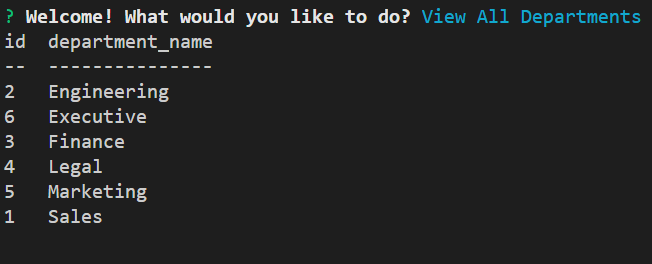
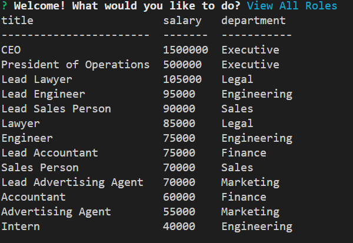
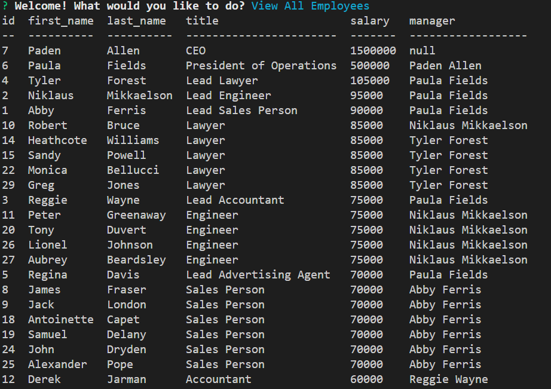

# employee-tracker

# Installation
  * Open the terminal
  * Type `npm init --y` Hit enter
  * Type `npm install --save mysql2` Hit enter
  * Type `npm install inquirer` Hit enter
  * Type `npm install console.table --save` Hit enter
  * Type `npm install node` Hit enter

# Instructions
  * Initialize the MySQL command line: `mysql -u root -p` and your MySQL password.

  * Run the `schema.sql` and `seeds.sql` files from the MySQL command line to create and populate the `company` database. Exit the MySQL command line when done.

  * Open the [server.js] file and do the following:

    * Update the `user` and `password` with your MySQL username and password.

  * Type `npm start` in the terminal to initiate the program.

# Built With
* MySQL2
* JavaScript
* Node.js
* Inquirer
* Console.Table

## Video Link
https://drive.google.com/file/d/1LxW8YjHajrbuASa2A2KCexe4KEaAjald/view

## Example Screenshot

## Contribution
Created with ❤️ by Paden Allen